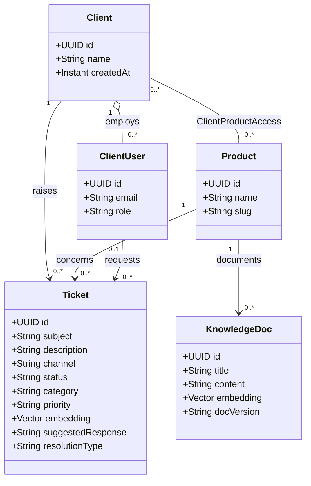
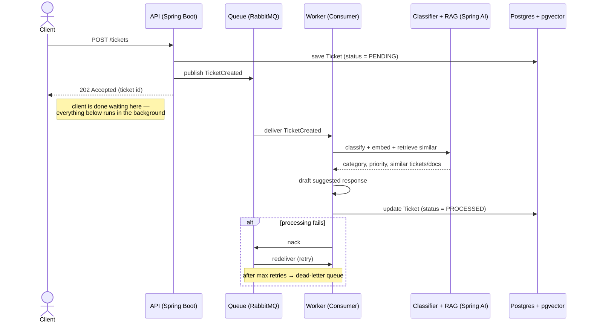

# ZenQ — UML Diagrams

The same system, three ways: what it's made of, what people do with it, and what actually happens
on the wire when a ticket comes in. UML defines about a dozen diagram types; most engineers reach
for three of them in practice. Each one below answers a different question, and each is drawn
straight from decisions already on record in `docs/DATA_MODEL.md`, `docs/IDEAS.md`, and
`docs/BUSINESS_CASE.md` — nothing here is invented for the diagram.

Diagrams below use [Mermaid](https://mermaid.js.org/) syntax (renders in GitHub, and in VS Code
with the "Markdown Preview Mermaid Support" extension — otherwise readable as plain text) and one
hand-drawn SVG for the use case diagram, since Mermaid has no native use-case diagram type.

---

## 01 — Structure: Class Diagram

Answers: *what are the things in this system, and how do they relate?* Each box is a class with
its fields; each line is a relationship. The numbers near each end of a line are
**multiplicities** — how many of one thing can connect to how many of the other. Read
`Client "1" -- "0..*" ClientUser` as: one Client has zero or more ClientUsers.

**Why it matters**: the `Client — Product` many-to-many line, resolved through
`ClientProductAccess`, is the exact boundary the multi-tenant self-service idea depends on — a
client's queries can only ever reach the products sitting on that line.

---

## 02 — Behavior: Use Case Diagram

Answers: *who uses this system, and what do they come to it to do?* Stick figures are **actors**
— roles outside the system. Ovals are **use cases** — things an actor can do. The rectangle is the
**system boundary**: everything inside is ZenQ's job, everything outside is someone else's. A
dashed arrow marked `«extend»` means one use case only happens as an optional continuation of
another.

<svg viewBox="0 0 900 460" role="img" aria-label="Use case diagram: Client, Support Agent, and Developer actors connect to use cases inside the ZenQ system boundary; Submit Ticket extends Ask a Question, meaning a ticket is only created when self-service does not already have the answer." style="max-width:100%;height:auto;background:#FBF8F2;border:1px solid #C9BFA9;border-radius:4px;">
  <defs>
    <g id="actor">
      <circle cx="0" cy="-30" r="9" fill="none" stroke="#182430" stroke-width="1.6"/>
      <line x1="0" y1="-21" x2="0" y2="14" stroke="#182430" stroke-width="1.6"/>
      <line x1="-14" y1="-6" x2="14" y2="-6" stroke="#182430" stroke-width="1.6"/>
      <line x1="0" y1="14" x2="-12" y2="34" stroke="#182430" stroke-width="1.6"/>
      <line x1="0" y1="14" x2="12" y2="34" stroke="#182430" stroke-width="1.6"/>
    </g>
    <marker id="arrowhead" viewBox="0 0 10 10" refX="8" refY="5" markerWidth="7" markerHeight="7" orient="auto-start-reverse">
      <path d="M0,0 L10,5 L0,10 z" fill="#B5622A"/>
    </marker>
  </defs>

  <rect x="185" y="30" width="560" height="410" rx="4" fill="none" stroke="#182430" stroke-width="1.4"/>
  <text x="465" y="20" text-anchor="middle" font-family="monospace" font-size="13" fill="#182430">ZenQ</text>

  <use href="#actor" x="65" y="255"/>
  <text x="65" y="308" text-anchor="middle" font-family="sans-serif" font-size="13" fill="#182430">Client</text>

  <use href="#actor" x="845" y="150"/>
  <text x="845" y="203" text-anchor="middle" font-family="sans-serif" font-size="13" fill="#182430">Support Agent</text>

  <use href="#actor" x="845" y="350"/>
  <text x="845" y="403" text-anchor="middle" font-family="sans-serif" font-size="13" fill="#182430">Developer</text>

  <ellipse cx="300" cy="100" rx="98" ry="34" fill="none" stroke="#182430" stroke-width="1.4"/>
  <text x="300" y="96" text-anchor="middle" font-family="sans-serif" font-size="12.5" fill="#182430">Ask a Question</text>
  <text x="300" y="112" text-anchor="middle" font-family="sans-serif" font-size="12.5" fill="#182430">(self-service)</text>

  <ellipse cx="300" cy="190" rx="98" ry="30" fill="none" stroke="#182430" stroke-width="1.4"/>
  <text x="300" y="195" text-anchor="middle" font-family="sans-serif" font-size="12.5" fill="#182430">Submit Ticket</text>

  <ellipse cx="300" cy="280" rx="98" ry="30" fill="none" stroke="#182430" stroke-width="1.4"/>
  <text x="300" y="285" text-anchor="middle" font-family="sans-serif" font-size="12.5" fill="#182430">Track Ticket Status</text>

  <ellipse cx="605" cy="100" rx="106" ry="32" fill="none" stroke="#182430" stroke-width="1.4"/>
  <text x="605" y="105" text-anchor="middle" font-family="sans-serif" font-size="12.5" fill="#182430">Review Suggested Reply</text>

  <ellipse cx="605" cy="215" rx="90" ry="32" fill="none" stroke="#182430" stroke-width="1.4"/>
  <text x="605" y="220" text-anchor="middle" font-family="sans-serif" font-size="12.5" fill="#182430">Resolve Ticket</text>

  <ellipse cx="605" cy="330" rx="106" ry="34" fill="none" stroke="#182430" stroke-width="1.4"/>
  <text x="605" y="326" text-anchor="middle" font-family="sans-serif" font-size="12.5" fill="#182430">Add Feature</text>
  <text x="605" y="342" text-anchor="middle" font-family="sans-serif" font-size="12.5" fill="#182430">Descriptor</text>

  <line x1="76" y1="238" x2="220" y2="118" stroke="#182430" stroke-width="1.2"/>
  <line x1="72" y1="255" x2="202" y2="192" stroke="#182430" stroke-width="1.2"/>
  <line x1="76" y1="272" x2="212" y2="272" stroke="#182430" stroke-width="1.2"/>

  <line x1="833" y1="163" x2="711" y2="105" stroke="#182430" stroke-width="1.2"/>
  <line x1="833" y1="177" x2="695" y2="222" stroke="#182430" stroke-width="1.2"/>

  <line x1="833" y1="336" x2="695" y2="230" stroke="#182430" stroke-width="1.2"/>
  <line x1="833" y1="355" x2="711" y2="335" stroke="#182430" stroke-width="1.2"/>

  <path d="M 300,160 C 300,140 300,132 300,134" fill="none" stroke="#B5622A" stroke-width="1.6" stroke-dasharray="5 4" marker-end="url(#arrowhead)"/>
  <text x="316" y="148" font-family="monospace" font-size="11.5" fill="#B5622A">&#171;extend&#187;</text>
</svg>

**Why it matters**: `Submit Ticket` extends `Ask a Question` rather than sitting beside it as an
equal option — a ticket is what happens when self-service doesn't already have the answer, not a
separate front door. That single dashed arrow is the whole portal-first idea drawn as a
relationship instead of a paragraph.

---

## 03 — Interaction: Sequence Diagram

Answers: *in what order do messages actually move, and who's waiting on whom?* Each vertical line
is a **lifeline** — one participant, alive for the length of the diagram. Arrows are messages,
read top to bottom. The API hands the client a `202 Accepted` well before classification or
retrieval happen — that gap is the entire reason the queue exists.

**Why it matters**: the `alt` block at the bottom is the idempotent retry / dead-letter path
behind the reliability target in `docs/BUSINESS_CASE.md` — a failed worker run doesn't lose the
ticket, it goes back through the queue up to a retry limit before landing in a dead-letter queue
for manual review.

---

*Drawn from `docs/DATA_MODEL.md`, `docs/IDEAS.md`, `docs/BUSINESS_CASE.md` — ZenQ, 2026-08-30*
